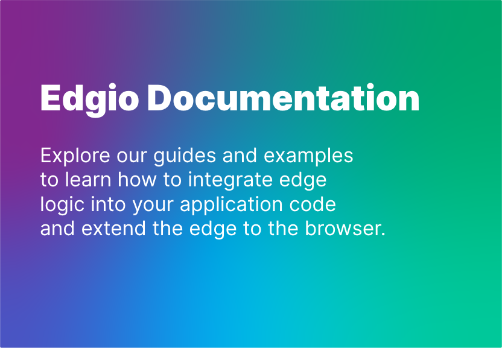

## Layer0 Documentation

<div align="center">
  
</div>

Explore the Layer0 guides and examples on how to integrate edge
logic into your application code and extend the edge to the browser.

---

## Getting Started

### 1. Fork and clone this repository

Fork this repository to your GitHub account and then clone it to your local environment.

### 2. Install dependencies

Install the dependencies:

```bash
yarn install
```

### 3. Develop locally

Start the development server on http://localhost:3000:

```bash
yarn dev
```

See the [Contributing Guide](https://docs.layer0.co/guides/contributing#how-to-contribute) on how to contribute to the Layer0 Documentation.